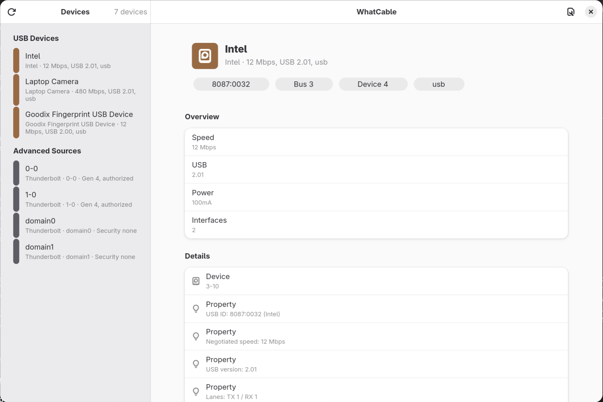

# WhatCable

A GNOME/GTK4 USB-C cable and power diagnostic viewer for Linux.



This is a Linux-native reimplementation inspired by
[`darrylmorley/whatcable`](https://github.com/darrylmorley/whatcable). It reads
kernel sysfs Type-C and USB Power Delivery classes and presents a plain-English
summary of each port.

## Current Scope

- Reads `/sys/class/typec` for Type-C ports, partners, cables, roles, and
  identity VDOs when the kernel exposes them.
- Reads `/sys/class/usb_power_delivery` for advertised source PDOs when
  available.
- Provides both a GNOME/libadwaita UI and a `--json`/`--raw` CLI.
- Runs without root for read-only sysfs access.

Linux support depends on your machine's Type-C/PD driver. If firmware handles
PD negotiation without exposing identity/capability data to the kernel, the app
can only show the subset present in sysfs.

## Development

```sh
meson setup build
meson test -C build
meson install -C build
whatcable-linux --json --raw
whatcable-linux
```

## Flatpak

The first version is designed to work as a normal read-only Flatpak app. The
default sandbox exposes the relevant sysfs paths read-only on current Flatpak:
`/sys/class`, `/sys/bus`, `/sys/dev`, and `/sys/devices`.

Build locally with:

```sh
flatpak-builder --user --install --force-clean build-flatpak build-aux/com.nedrichards.WhatCable.json
flatpak run com.nedrichards.WhatCable
```

If rofiles-fuse is not available in the build environment, add
`--disable-rofiles-fuse` to the `flatpak-builder` command.

`build-aux/stable/com.nedrichards.WhatCable.json` is the release-style manifest
intended for Flathub submission. It builds from the published `v0.1.0` Git tag
instead of the local checkout.

## AppStream

The AppStream metadata lives in
`data/com.nedrichards.WhatCable.metainfo.xml`. It includes the project URLs,
content rating, release entry, and screenshot required for a Flathub review.

## License

WhatCable Linux is licensed under the GNU General Public License v3.0 or later.
See `COPYING` for the full license text.

---
*Co-authored with a bunch of different AIs*
