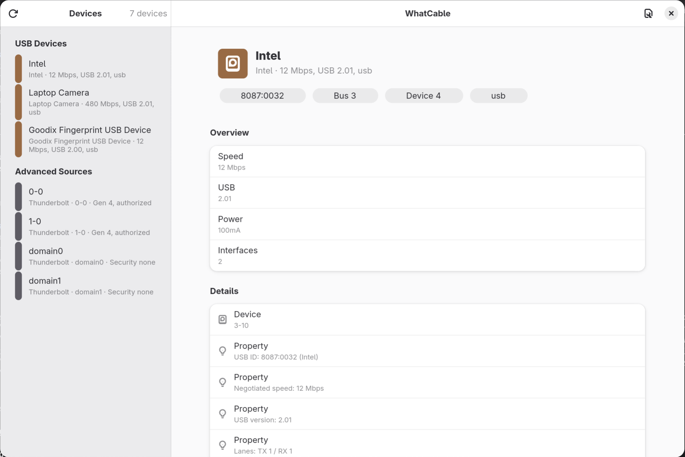

# WhatCable

A GNOME/GTK4 USB-C cable and power diagnostic viewer for Linux.



This is a Linux-native reimplementation inspired by
[`darrylmorley/whatcable`](https://github.com/darrylmorley/whatcable). It reads
kernel sysfs Type-C and USB Power Delivery classes and presents a plain-English
summary of each port.

## Current Scope

- Reads `/sys/class/typec` for Type-C ports, partners, cables, roles, and
  identity VDOs when the kernel exposes them.
- Reads `/sys/class/usb_power_delivery` for advertised source PDOs when
  available.
- Reads Chrome EC firmware metadata and, when `/dev/cros_ec` is accessible,
  Framework per-port role, charging type, voltage, current, and maximum power.
- Provides both a GNOME/libadwaita UI and a `--json`/`--raw` CLI.
- Runs without root for read-only sysfs access.

Linux support depends on your machine's Type-C/PD driver. If firmware handles
PD negotiation without exposing identity/capability data to the kernel, the app
can only show the subset present in sysfs or through a supported hardware
backend such as the Framework Chrome EC path.

## Kernel Support

WhatCable follows the Linux kernel's current [Type-C][kernel-typec] and
[USB Power Delivery][kernel-pd] sysfs ABIs. It reads directory-based source
PDOs (fixed, variable, battery, programmable/PPS, and adjustable-voltage
supplies) and retains best-effort support for older or driver-specific
attributes containing raw PDO values.

There is no useful kernel-version-only minimum: the available data depends on
the hardware, firmware, and Type-C driver as well as the kernel. Missing sysfs
classes or individual attributes are treated as unavailable data, and devices
may appear or disappear safely while a scan is running.

Development and testing track the author's current Fedora Silverblue system.
The latest recorded baseline is Fedora Silverblue 44 (`44.20260724.0`) with
kernel `7.1.4-204.fc44.x86_64`, checked on 26 July 2026. Older kernels are
supported on a best-effort basis where they expose compatible sysfs data.

[kernel-typec]: https://docs.kernel.org/driver-api/usb/typec.html
[kernel-pd]: https://docs.kernel.org/admin-guide/abi-testing-files.html#abi-file-testing-sysfs-class-usb-power-delivery

## Development

```sh
meson setup build
meson test -C build
meson install -C build
whatcable-linux --json --raw
whatcable-linux
```

## Flatpak

The first version is designed to work as a normal read-only Flatpak app. The
default sandbox exposes the relevant sysfs paths read-only on current Flatpak:
`/sys/class`, `/sys/bus`, `/sys/dev`, and `/sys/devices`.

The manifests use `--device=all` because hardware inspection is the purpose of
the app. On Framework systems this makes `/dev/cros_ec` visible, but it does not
override the host device's permissions. Without access, WhatCable still shows
the readable Chrome EC firmware metadata and labels PD power information as
unavailable. For a temporary local test, grant the current user read access on
the host (the ACL normally resets when the device is recreated):

```sh
sudo setfacl -m "u:${USER}:r" /dev/cros_ec
```

WhatCable opens the device read-only and only issues
`EC_CMD_USB_PD_POWER_INFO`; it does not expose arbitrary EC commands.

Build locally with:

```sh
flatpak-builder --user --install --force-clean build-flatpak build-aux/com.nedrichards.WhatCable.json
flatpak run com.nedrichards.WhatCable
```

If rofiles-fuse is not available in the build environment, add
`--disable-rofiles-fuse` to the `flatpak-builder` command.

`build-aux/stable/com.nedrichards.WhatCable.json` is the release-style manifest
intended for Flathub submission. It builds from the published `v0.1.0` Git tag
instead of the local checkout.

## AppStream

The AppStream metadata lives in
`data/com.nedrichards.WhatCable.metainfo.xml`. It includes the project URLs,
content rating, release entry, and screenshot required for a Flathub review.

## License

WhatCable Linux is licensed under the GNU General Public License v3.0 or later.
See `COPYING` for the full license text.

---
*Co-authored with a bunch of different AIs*
